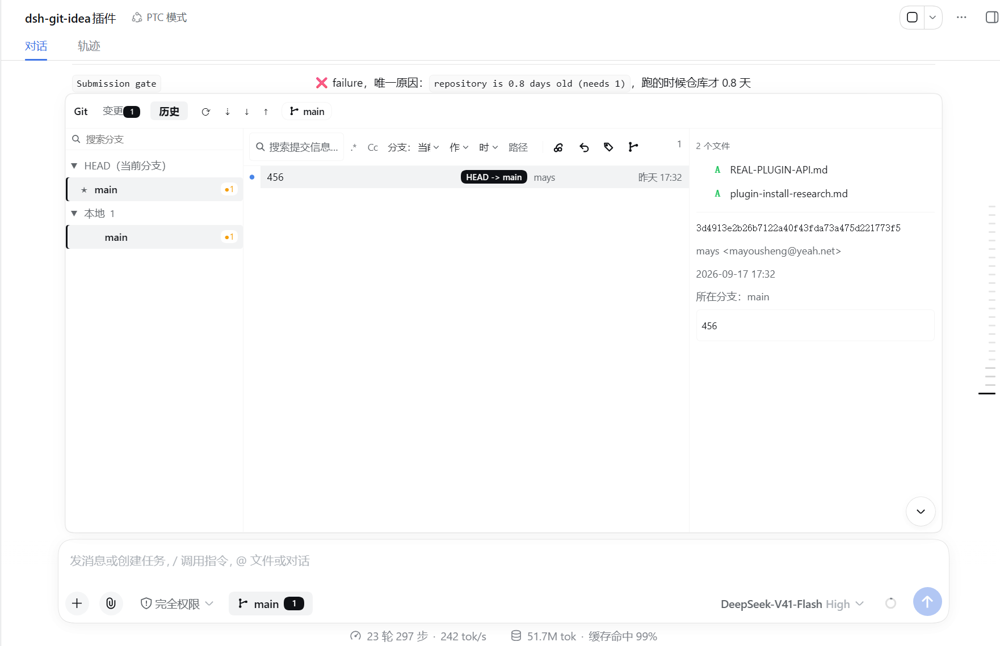
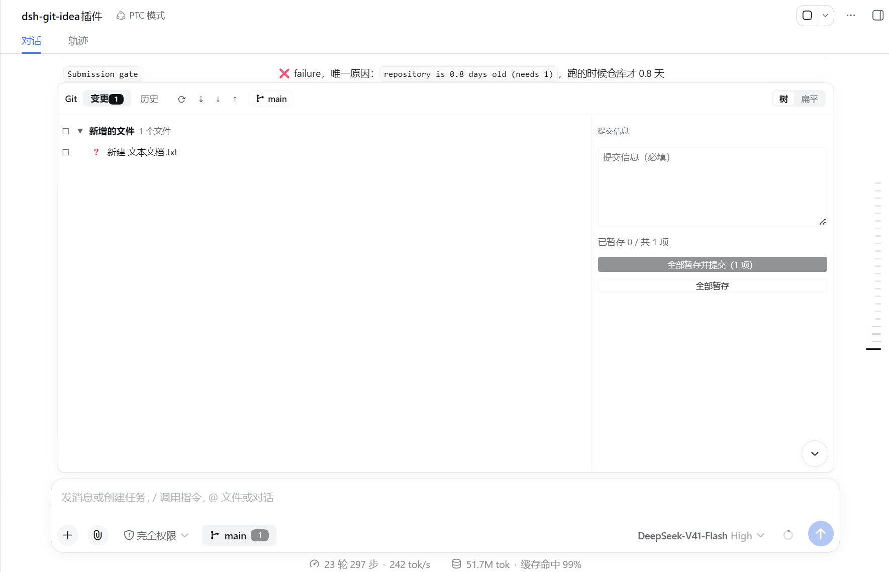
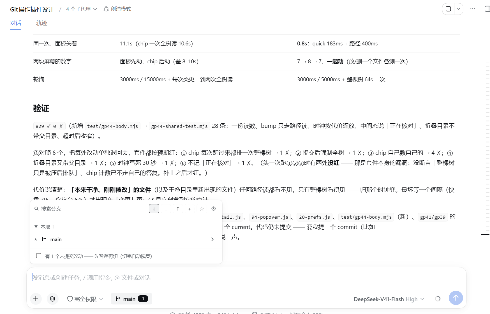

# dsh-git-idea

照着 IDEA 的 VCS 做的 Git 集成，装进 DSH 会话：输入框「**权限模式**」旁边一个 Git 图标 —— 显示当前分支与未提交改动数，**悬停**切分支，**点击**弹出 IDEA 风格的面板（分支树、提交历史与提交图、变更与暂存、提交详情、文件差异），另有一个**设置页**管提交身份、git 位置和网络参数。

**不向 DSH 注册任何模型工具**（模型要跑 git 本来就有 `bash`，见[不注册工具](#不注册工具)）。
**面板属于会话，不属于窗口**：同一页面里的每个会话各看各的工作区。

> Git integration for DeepSeek Harness, modelled on IDEA's VCS — a git icon beside the permission mode in the composer (branch + pending count), a branch switcher on hover, an IDEA-style VCS panel on click, and a settings page. Registers no model tools with DSH.

| | |
|---|---|
| 当前版本 | **0.2.6** |
| 下载 / 安装 | `dsh plugin --profile web add dsh-git-idea`（npm）· `github:mays-hi/dsh-git-idea`（GitHub）· 本地目录 |
| 依赖 | DSH `>=0.1.5-rc.1`（`engines.dsh`，只声明最低版本）；`@deepseek-ai/cordis ^4.0.2`（peer） |
| 仓库 | <https://github.com/mays-hi/dsh-git-idea> |

---

## 安装

要求 DSH `>=0.1.5-rc.1`（只声明最低版本；peer：`@deepseek-ai/cordis ^4.0.2`）。DSH 0.1.7 把执行器的一次性 `run(spec)` 换成了 `execute(spec)` 加 `result()`，Host 那一半两种形状都认 —— 0.1.5/0.1.6 和 0.1.7+ 装的是同一份包。0.1.7 的 `sessions.get` 也只回答活着的会话，解析会话工作区时会退到 `sessionPersistence` 读会话头，刚选中、还在恢复的会话因此也能读到。

```sh
dsh plugin --profile web add dsh-git-idea                    # npm
dsh plugin --profile web add github:mays-hi/dsh-git-idea      # GitHub
dsh plugin --profile web add /path/to/dsh-git-idea            # 本地
```

装完**重启 `dsh web`**。报 `ERR_PNPM_ADDING_TO_ROOT` 就在包名前加 `-w`。

> 已经跑着旧版动态插件（`<DSH_HOME>/dsh-git-idea` 那个桥）就先停掉 —— 两个都装着就是两份 chip、两个面板抢同一个 slot。

---

## 用法

### chip（输入框「权限模式」旁边那个 Git 图标）

| 操作 | 结果 |
|---|---|
| 看 | 当前分支 + 未提交文件数（`工作区干净` / `3 个改动`） |
| 悬停 | 分支切换卡片，点一下切过去（可在设置里关） |
| 点击 | 开 / 收面板 |

### 面板

```
变更 3 │ 历史    ⟳ ⇣ ↓ ↑    feature-risk ↑2 ↓1    树 扁平
─────────────┬──────────────────────┬──────────────────────
分支树        │ 变更树 / 提交列表      │ 差异 / 提交详情 /
HEAD 本地 远程 │                      │ 提交信息与提交按钮
```

| 区域 | 内容 |
|---|---|
| 顶栏 | `变更`（带数量）/ `历史` 页签；`⟳` 重读、`⇣` fetch、`↓` pull、`↑` push（带领先/落后角标）；中间是当前分支，点开切换器；右端「树 / 扁平」切换变更页视图 |
| 左栏 | 分支树：`HEAD` / `本地` / `远程`，带搜索、收藏、排序；行尾 `›` 是该分支的动作（检出、从此分支新建分支、合并到当前分支、删除） |
| 中栏 | `变更` 页是工作区，`历史` 页是提交列表 + 提交图 |
| 右栏 | 差异 patch / 提交详情 / 提交信息与提交按钮 |



*`历史` 页：左边分支树（`HEAD` / `本地` / `远程`），中间提交列表与提交图，右边是选中提交的详情、改动文件与提交信息。*



*`变更` 页：没跟踪的文件也在树里（红色 `?`）；右边写提交信息，下面是「全部暂存并提交（N 项）」和「全部暂存」，右上角切「树 / 扁平」。*

面板的边角可拖动，尺寸记得住。

### 手势（与 IDEA 的树一致）

| 行 | 单击 | 双击 / 点三角 |
|---|---|---|
| 目录行（分支树、变更树、提交文件树） | 只选中 | 展开 / 折叠 |
| 未跟踪目录（git 折叠成一行的那种） | 只选中，不发读取 | 读取并展开 |
| 分支行 | 只选中 | 把历史切到该分支 |
| 分组标题（HEAD / 本地 / 远程） | 只选中 | 展开 / 折叠 |
| 文件行 | 打开差异 | — |
| 分组标题最左的复选框 | 整组进 / 出索引 | — |

### 常见动作

| 想做什么 | 怎么做 |
|---|---|
| 提交 | `变更` 页勾选 → 右栏写提交信息 → 「全部暂存并提交（N 项）」或「全部暂存」 |
| 只提交一部分 | 只勾那几个文件；再点一次勾选框 = 取消暂存 |
| 看某个文件的改动 | 在变更树或提交详情里点该文件，patch 占满正文，左上角箭头返回 |
| 切分支 | 点顶栏分支名（或悬停 chip）→ 选分支 → 检出 |
| 新建分支 | 切换器底部「新建分支」，可从某个提交或分支起 |
| 合并 / 拣选 / 还原 | 分支行 `›` → 合并到当前分支；提交详情右上角图标 → 拣选 / 还原 |
| 打标签 | 提交详情 → 标签图标 → 填名字 |
| 拉取 / 推送 | 顶栏 `⇣ ↓ ↑`；没有上游时右栏给出「设置上游并推送」 |
| 冲突 | 顶栏横幅「正在合并：N 个文件冲突」+ 继续 / 跳过 / 中止；解决并暂存后点继续 |
| 搜索历史 | 默认字面匹配，`.*` 切正则，`Cc` 区分大小写；`分支:` `作者:` 时间 路径 各是一个筛选 |
| 更早的提交 | 列表底部「加载更多」，一次 200 条 |

### 提交被 git 拒了

`git commit` 要署名，而名字和邮箱写在 **git 自己的配置里**，不在仓库里。这台机器没配过时，提交会被 git 拒绝。

两条路，都留着：设置页 **dsh-git-idea配置 → 提交身份** 里填一次（面板并不总是开着），或者在终端里跑

```sh
git config --global user.name "你的名字"
git config --global user.email "你的邮箱"
```

（不加 `--global` 只对当前仓库生效。）面板不会替你署名 —— 署谁的名字只有你知道 —— 但它会在提交区**先说**这件事，被拒之后把上面那两条原样写出来，连 git 自己最后一行一起。写完之后不用重启，下一次读取（30 秒的时钟，或任意一次暂存 / 提交）就不再提醒。

同一类失败不只出现在「提交」上：拣选、还原、合并的继续、pull 都要造提交对象，它们走同一个判据（`git var GIT_AUTHOR_IDENT`，也就是 `git commit` 自己拼身份时走的那条路，任何语言下都是同一个退出码）；而 `git add`、`git branch -d`、中止这些在没有身份的机器上照跑，面板不会把它们说成身份问题。

### 看哪个仓库

只看**会话工作区那一个目录**，且 `<dir>/.git` 必须存在 —— 不向上找父目录，也不往里看子目录。
引导页可以改成别的目录：「打开这个目录」进那个路径；那里还不是仓库时旁边有「在此初始化仓库」（`git init`，默认分支见设置）。

### 读不动时

每一种理由说自己的话，能做的事不同：

| 情况 | chip | 面板 |
|---|---|---|
| 路径还没定 | 还没确定看哪个目录 —— 点击填写 | 「无法确定要查看的仓库路径」+ 路径框 |
| 路径不存在 | 目录不存在：… —— 点击修改路径 | 「目录不存在」+ 路径框 |
| 路径是个文件 | 这不是一个目录：… —— 点击修改路径 | 「这不是一个目录」+ 路径框 |
| 目录在，不是仓库 | … 这个目录不是 Git 仓库 —— 点击查看 | 「这个目录不是 Git 仓库」+「打开这个目录」/「在此初始化仓库」 |
| git 在，读不动它 | … 读取失败 —— 点击查看原因 | 「git 命令执行失败」+ git 的原话 |
| 机器上没有 git | …：这台机器上找不到 git —— 点击查看 | 同一页改说这件事，路径框和初始化按钮都收起（都不是出路），装好 git 再点「打开这个目录」 |

「不是 Git 仓库」那一页故意没有路径框：路径不是问题，没什么可填的。


---

## 设置

Settings → **dsh-git-idea配置**。

**插件级**（写 `$DSH_HOME/dsh-git-idea.json`，默认 `~/.dsh/dsh-git-idea.json`，换浏览器一致）。这份文件在工作区之外，所以它和这个插件改的其它东西走同一条路：能不能写由**这个会话的沙箱策略**决定，写不进去时页面上会明说（而不是安静地什么也没发生）：

| 项 | 默认 | 说明 |
|---|---|---|
| 初始化仓库的默认分支 | `main` | 引导页「在此初始化仓库」执行 `git init -b <值>`；留空用 git 自己的默认值 |
| cherry-pick 时记录来源（`-x`） | 关 | 提交时是否带 `-x` |
| git 位置 | 空（用 PATH 上的 git） | 面板每一条命令都以这一个词开头；装在不在这条 PATH 上的地方（Homebrew 前缀、IDE 自带的 git、nix profile）时写绝对路径。旁边实时显示它解析到哪、什么版本、能不能跑 |
| fetch 时删掉远端已删的远程分支（`--prune`） | 开 | 关掉就是 `git fetch --all` |
| pull 用 rebase（`--rebase`） | 关 | 关掉就是 `git pull`（merge） |
| 推送没有上游的分支时自动设上游（`push -u`） | 关 | 关掉时推送失败后面板问一句「推送并设为上游」 |

这三条网络项是**面板给 git 的实参**，不是 git 设置的副本：没勾的就是 git 原本的行为，`push.default`、`pull.rebase` 照旧生效。设置页底部还照着实参写一遍会执行成什么（`git fetch --all --prune · git pull · …`）。

**git 自己的配置**（不在上面那个 json 里）：设置页的「提交身份」直接读写 `user.name` / `user.email`，也就是终端里的 git、IDEA、钩子看到的同一份。它先显示此刻生效的那一份**和它的来源**（`.git/config` 还是 `~/.gitconfig`），然后让你选写进哪里 —— 这台机器的所有仓库（`--global`）或只这一个仓库（`--local`）。空着的框一个字节都不写：`git config user.name ''` 正是「empty ident name」那个错误的来路。

**浏览器级**（只写当前浏览器 localStorage）：

| 项 | 默认 | 说明 |
|---|---|---|
| 后台监测仓库变化并自动刷新 | 开 | 关掉后下面的节奏选项一并失效 |
| 面板打开时每 N 秒检查 | 3（1–120） | |
| 面板关着时每 N 秒检查 | 5（2–600） | 只发一次廉价签名（读者那台机器 0.12s），所以问得比过去勤 —— 15 秒的话，终端里提交完要过十几秒 chip 才改口 |
| 面板关着时也监测 | 开 | 让 chip 的分支名和改动数保持实时 |
| 悬停弹出分支切换卡片 | 开 | |
| 面板尺寸 | 跟随输入框宽度 / 74vh | 可恢复默认 |
| 变更页视图 | 树 | 或平铺列表 |
| 切换器记忆 | — | 可清除最近使用与收藏 |

### 一次「仓库动过了」之后，插件要花多久才排空

这条 RPC 通道**一次只跑一个处理函数**（实测：一次 8 秒的读在飞的时候，连不 spawn 的
`git/flush`、`git/config` 都要等 8 秒才回）。所以一次全树 `git status` 不只是慢，它把
整块 UI 按在那里 —— 读者那台机器上（Windows 挂载的工作区、5093 个文件、全树 status
8.1s 冷 / `-uno` 也要 5.3s）量到过：

| 场景 | 改之前 | 改之后 |
|---|---|---|
| 终端里提交一次（引用变了），面板开着 | 16 条请求，队列 **21.3s** 排空，其中 13s 是两次全树读 | 队列 **0.4s**：面板问屏上那 7 条路径（0.2s），chip 问身份（0.4s）+ 同样那几条路径（Host 那边是同一个问题，只起一个进程） |
| 同样一次，面板关着 | 4 条请求，排空 **11.1s**（chip 一次全树读 10.6s） | 队列 **0.5s**：chip 只问身份 + 上次那些脏路径 |
| 这个仓库这个浏览器第一次看 | 11s+ | 一样要一次全树读（没量过就没有数字），但那一次之后走上面两条 |

屏幕上的样子是「面板反应过来了，chip 还没」—— 面板那条 0.2s 的路径读排在 chip 那条
8–10s 的全树读后面。现在：

* **「工作区有几个改动」全局只有一份读数**（面板量的、chip 量的都写在同一处），
  chip 上那个数字就是面板「变更」页签上那个数字，两块屏幕不可能各说各话；
* 一次 bump 之后只问**屏上那些路径**，整棵树不在那条路上。这里还有个量出来的坑：
  git 把没跟踪的目录折叠成一条，而**那条本身就是自己的子树** —— 再顺手带上「它所在的
  目录」就等于把旁边整棵大树扫一遍。读者那个仓库上：

  | 问哪些路径 | 耗时 |
  |---|---|
  | 7 条（快照里那些路径本身，含 3 条折叠目录） | **280ms** |
  | 12 条（每条再带上它所在的目录） | **6138ms** ← `holox-modules` 一条吃掉了全部 |
  | 9 条（折叠目录不带所在目录） | **295ms** |

  所以折叠目录那条只问它自己；文件的所在目录留着（「旁边新出现的文件」还靠它看见）。
  另外量到一次路径读本身超过 1.5s 时，这个仓库整个收窄成只问那几条路径本身；

* 整棵树有**自己的时钟**，间隔按上一次实测的代价来定：`max(30 秒, 8 × 上次耗时)`，
  上限 5 分钟。快盘上照旧 30 秒一次；读者那台机器上一次 8 秒，于是 64 秒一次 ——
  不再每 30 秒把整条通道冻 8 秒。⟳ 按钮永远立刻整棵树重读一次；
* 还没核对出来的时候 chip 说的是「**正在核对改动…**」，不谎称「工作区干净」。

代价说清楚：**「本来干净、刚刚被改」的那个文件**（以及干净目录里新出现的文件）任何
路径读都看不见，只有整棵树读能看见 —— 它由上面那个时钟兜着，所以最坏情况下要等一个
间隔（快盘 30 秒，慢盘 64 秒）才出现在「变更」页里。⟳ 是立刻拿到它的办法。

---

## 不注册工具

插件给 DSH 的只有 UI 和它自己的 RPC 通道：27 条 `host.call('git/…')`（面板、chip、设置页走的就是它们）。模型要跑 git 本来就有 `bash`，所以不注册工具。

撤掉那 8 个工具（`git`、`git_status`、`git_log`、`git_diff`、`git_commit`、`git_branch`、`git_stash`、`git_sync`）时量到的：

| 量到的 | 数 |
|---|---|
| 8 个工具的 schema | **7210 字节／每次请求**（约 1800 token，与这一轮是否碰 git 无关） |
| 只为它们存在的 Host 代码 | **约 908 / 2577 行（35%）**：`40-tools` 533 行、`20-safety` 中 160 行、`30-render` 中 215 行 |
| 客户端调用工具的次数 | **0** —— 面板只走 `host.call('git/…')`，撤工具对 UI 零影响 |

代价：`git_diff` 原先把差异渲染成 GUI 里的原生 diff 卡，现在记录里只有文本。

---

## 开发

源码按功能拆片段，构建就是按顺序拼接，没有转译、打包或压缩。改代码改 `src/`。

```sh
node build-package.mjs          # 正式包：lib/index.js + client/client.js
node build.mjs                  # 动态桥：host.js + client.js
node test/run-all.mjs           # 全部断言（829 条）
node build.mjs --check && node build-package.mjs --check   # 产物是否最新
node test/bench.mjs             # 基准：200 条提交的历史列表
node test/bench-branch.mjs      # 基准：300 个分支的切换器
```

`test/run-all.mjs` 跑断言前先检查三样东西是否落后于源码：动态桥产物、正式包产物、每个套件文件。



*开发时的验证记录：`test/run-all.mjs` 829 条断言、0 失败，以及「一次仓库动过之后要排空多久」的对照。*

```
package.json          npm / DSH manifest（dsh.bundle patch + dsh.client web）
cordis.patch.yml      bundle 层插入的插件行
lib/index.js          构建产物：Host 半侧（ESM，插件对象 + 同源 RPC 路由）
client/client.js      构建产物：Client 半侧（__ModuleLoader__ bundle）
src/host/*.js         Host 源码片段（12 个）
src/client/*.js       Client 源码片段（23 个）
src/pkg/*.js          正式包的 prelude / postlude
build-package.mjs     正式包构建
build.mjs             动态桥构建
host.js client.js     构建产物：动态桥读取的两个半侧（旧运行方式，保留）
docs/                 README 的图
test/                 断言套件与性能基准
```

Host 与 Client 的片段各自共享一个作用域：一个片段可以用它上面片段定义的东西，反之不行。

---

## 许可

MIT
